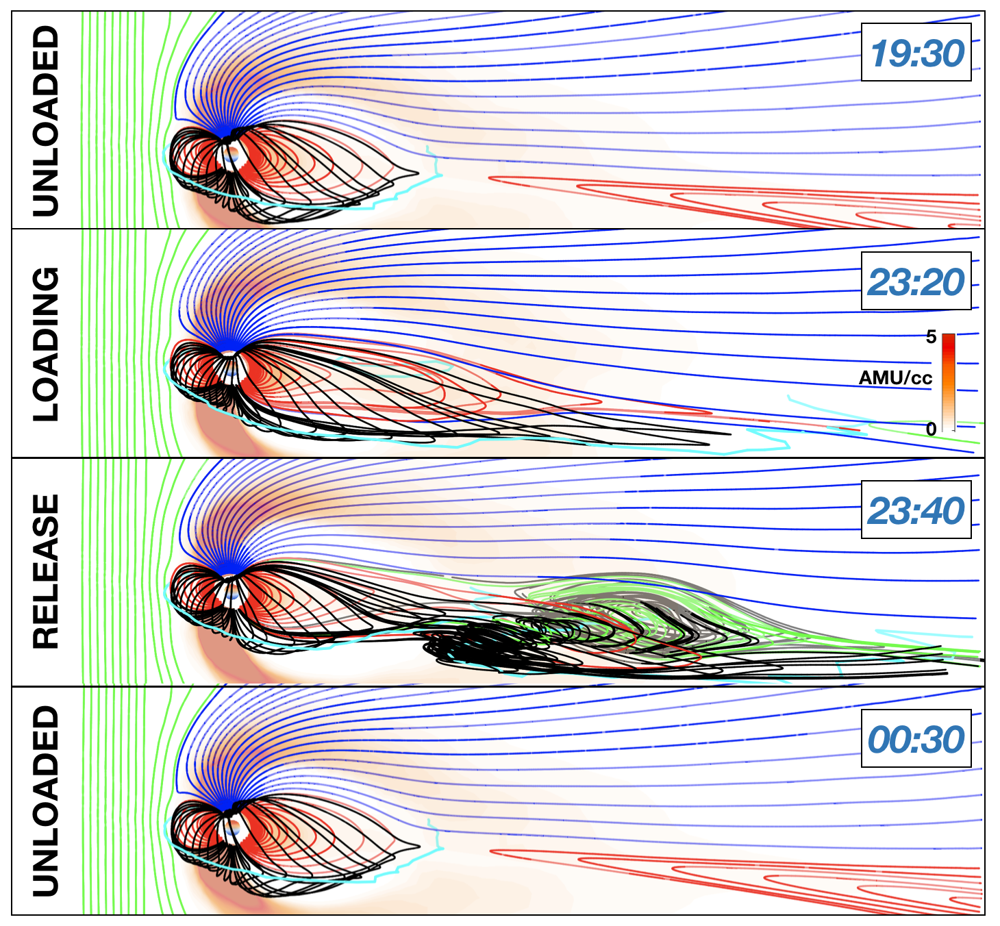

[Download paper here](http://academicpages.github.io/files/paper2.pdf)

Zhang, B., Brambles, O. J., Lotko, W., & Lyon, J. G. ( 2020). Is nightside outflow required to induce magnetospheric sawtooth oscillations. Geophysical Research Letters, 47, e2019GL086419. https://doi.org/10.1029/2019GL086419

Motivation
======

Results
======
